# Grafana 告警通知設定 Grafana Alert Notification Settings

在日誌收容的架構中，本系統提供 Grafana 儀表板供維運人員進行查閱，利用視覺化的呈現，減少人員的操作進入門檻。
In the log containment architecture, this system provides Grafana dashboard for maintenance personnel to review, using visualization to reduce the entry barrier for operations.

以下提供儀表板之操作步驟：
1. 登入 Grafana
2. 串接資料來源
*  2.1 資料來源一：metricbeat
*  2.2 資料來源二：suricata
3. 匯入儀表板
*  3.1 匯入「系統資源監控」儀表板
*  3.2 匯入「入侵偵測告警」儀表板
4. 設定告警
*  4.1 設定「系統資源監控」儀表板的告警
*  4.2 設定「入侵偵測告警」儀表板的告警
5. 設定告警通知
*  5.1 設定收信人
*  5.2 設定告警通知
Here is the following operation steps of  dashboard:
1. Log in Grafana
2. Connect data sources
* 2.1 Source 1: metricbeat
* 2.2 Source 2: suricata
3. Import Dashboard
* 3.1 Import the "System Resource Monitoring" dashboard
* 3.2 Import "Intrusion Detection Alert" dashboard
4. Setting alert
* 4.1 Set the alert of the "System Resource Monitoring" dashboard
* 4.2 Set the alert of the "Intrusion Detection Alert" dashboard
5. Set alert notification
* 5.1 Set recipient
* 5.2 Set alert notification
***

# 1. 登入 Grafana Log in Grafana

儀表板之登入預設網址為「http://your_ip:13000」，預設帳號為 admin，預設密碼為 admin。填入後按「Log In」按鈕。
The default login URL of the dashboard is "http://your_ip:13000", the default account is admin, and the default password is admin. After filling in, press the "Log In" button.

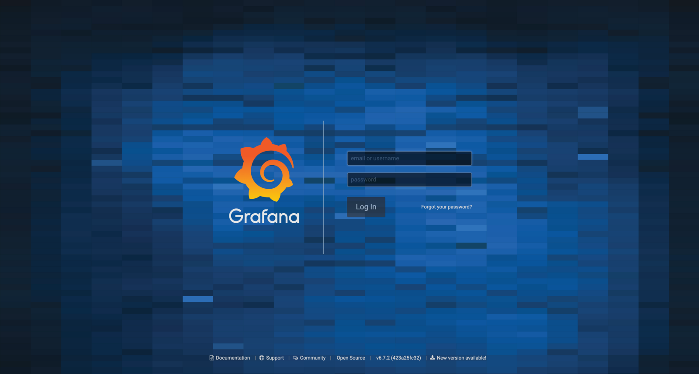

若使用預設admin帳號登入，並且沒有更改預設admin密碼的話，在按下「Log In」按鈕後，會出現「Change Password」的修改預設密碼提醒畫面。若要修改密碼，可於此畫面輸入新密碼，並按下「Save」按鈕儲存新密碼。若不需修改密碼，則可直接按「Skip」按鈕即可跳過此步驟，以後再到系統中修改密碼即可。
If you log in with the default admin account and you have not changed the default admin password, after pressing the "Log In" button, the "Change Password" reminder screen for modifying the default password will appear. If you want to change the password, you can enter the new password on this screen and press the "Save" button to save the new password. If you don't need to change the password, you can just press the "Skip" button to skip this step, and you can change the password in the system later.

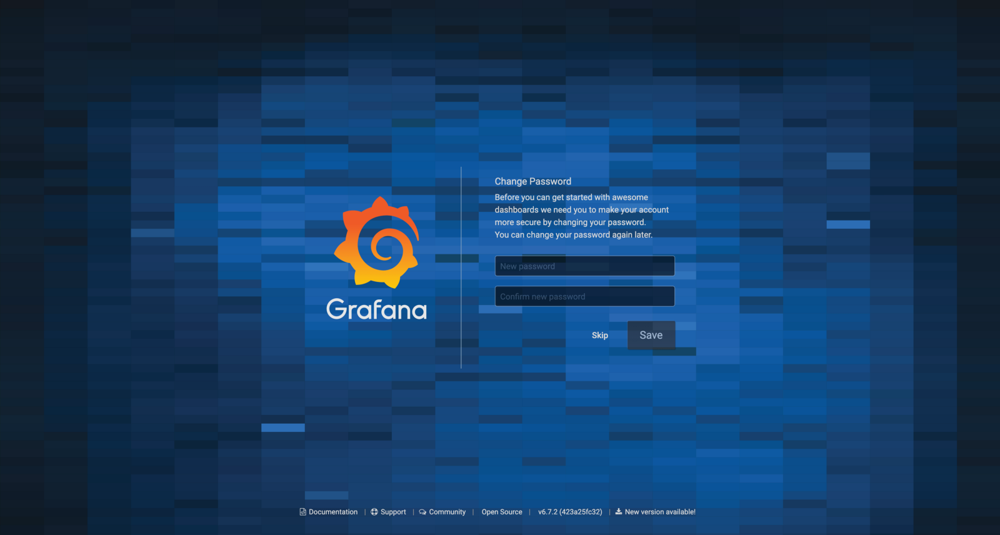

登入後會到空白的 Home 頁面。依 Grafana 版本不同，Home 頁面會略有不同，以下畫面為 Grafana v.6.2.5 的 Home 頁面。右下角的區塊是已安裝的 plugins，清單會略有不同。
After logging in, you will be brought to a blank Home page. Depending on the version of Grafana, the Home page will be slightly different. The following screen is the Home page of Grafana v.6.2.5. The block in the lower right corner is the installed plugins, the list will be slightly different.

***

# 2. 串接資料來源 Connect the Data Source

至左邊選單的「Configuration」>「Data Sources」頁面，按下「Add data source」按鈕，新增資料來源。
Go to the page of the left menu "Configuration"> "Data Sources" , and click the "Add data source" button to add a data source.

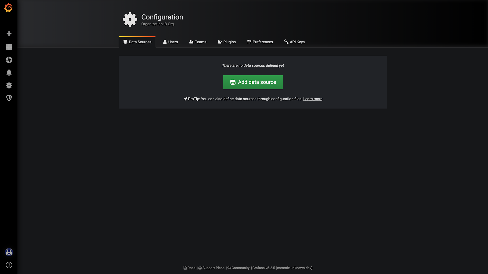

在資料來源類型清單中，選擇「Elasticsearch」。
Choose "Elasticsearch" from the list of data source types. 

## 2.1 資料來源一：metricbeat Source 1: metricbeat

新增一個名為「metricbeat-*」的資料來源，並填入以下資訊：
* 在 Name 欄位填入「metricbeat-*」
* 在 URL 欄位填入「http://your_ip:19200」
* 在 Elasticsearch details 區塊，Index name 欄位填入「metricbeat-*」
* Time field name 填入「@timestamp」
* Version 選擇「7.0+」
Add a data source named "metricbeat-*" and fill in the following information:
* Fill in "metricbeat-*" in the Name field
* Fill in "http://your_ip:19200" in the URL field
* In the Elasticsearch details block, fill in "metricbeat-*" in the Index name field
* Time field name is filled in "@timestamp"
* Select "7.0+" version

填完後按下綠色「Save & Test」按鈕，若出現「Index OK. Time field name OK.」訊息則表示成功。
After filling in, press the green "Save & Test" button. If the message "Index OK. Time field name OK." appears, it means success.

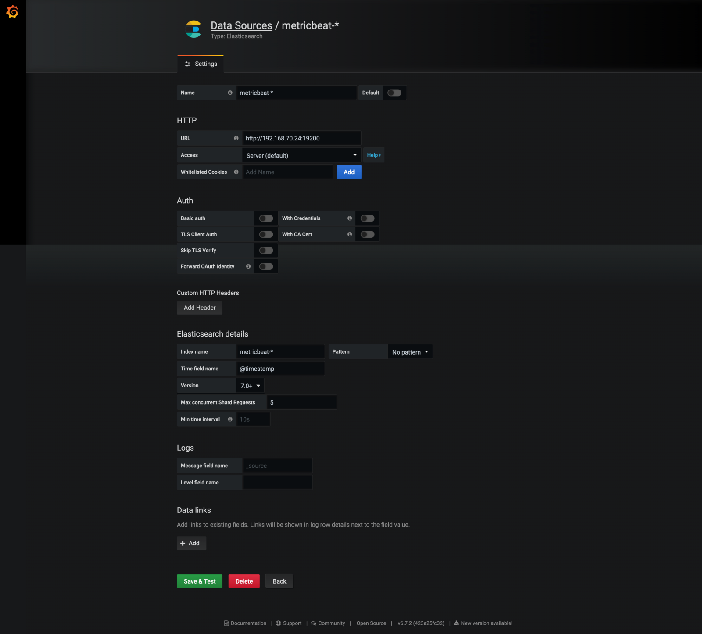

## 2.2 資料來源二：suricata Source 2: suricata

再新增一個名為「suricata-*」的資料來源，並填入以下資訊：
* 在 Name 欄位填入「suricata-*」
* 在 URL 欄位填入「http://your_ip:19200」
* 在 Elasticsearch details 區塊，Index name 欄位填入「suricata-*」
* Time field name 填入「log_time」
* Version 選擇「7.0+」
Add another data source named "suricata-*" and fill in the following information:
* Fill in "suricata-*" in the Name field
* Fill in "http://your_ip:19200" in the URL field
* In the Elasticsearch details block, fill in "suricata-*" in the Index name field
* Time field name fill in "log_time"
* Select "7.0+" version

填完後按下綠色「Save & Test」按鈕，若出現「Index OK. Time field name OK.」訊息則表示成功。
After filling in, press the green "Save & Test" button. If the message "Index OK. Time field name OK." appears, it means success.

***

# 3. 匯入儀表板 Import the dashboard

至左邊選單的「Create」>「Import」頁面，匯入從 GitHub SecBuzzerESM 專案下載的儀表板，儀表板檔案會放在「SecBuzzerESM」>「grafana_dashboards」中。
Go to the page of the left menu "Create"> "Import" and import the dashboard downloaded from the GitHub SecBuzzerESM project. The dashboard file will be placed in "SecBuzzerESM"> "grafana_dashboards".

## 3.1 匯入「系統資源監控」儀表板 Import "System Resource Monitoring" dashboard

在「Import」頁面按下右上角的綠色按鈕「Upload .json file」，選擇「系統資源監控.json」檔案（此檔案會位於「SecBuzzerESM」>「grafana_dashboards」中），按下「Import」按鈕。
On the "Import" page, press the green button "Upload .json file" in the upper right corner, select the "系統資源監控.json" file (this file will be located in "SecBuzzerESM"> "grafana_dashboards"), and click the "Import" button.

匯入成功即可看到「系統資源監控」儀表板畫面。此儀表板的資料來源是與「metricbeat-*」串接，若沒有順利看到儀表板圖表，請注意資料來源「metricbeat-*」的設定是否與上一個章節「2. 串接資料來源」中的設定一致。
After the import is successful, you will see the "System Resource Monitoring" dashboard. The data source of this dashboard is connected with "metricbeat-*". If you do not see the dashboard chart smoothly, please pay attention to whether the setting of the data source "metricbeat-*" is the same as in the previous chapter "2. Connecting data source".

## 3.2 匯入「入侵偵測告警」儀表板 Import "Intrusion Detection Alert" dashboard

在「Import」頁面按下右上角的綠色按鈕「Upload .json file」，選擇「入侵偵測告警.json」檔案（此檔案會位於「SecBuzzerESM」>「grafana_dashboards」中），按下「Import」按鈕。
On the "Import" page, press the green button "Upload.json file" in the upper right corner, select the "入侵偵測告警.json" file (this file will be located in "SecBuzzerESM"> "grafana_dashboards"), and click the "Import" button .

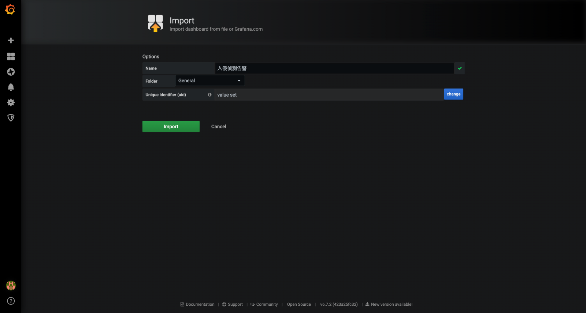

匯入成功即可看到「入侵偵測告警」儀表板畫面。此儀表板的資料來源是與「suricata-*」串接，若沒有順利看到儀表板圖表，請注意資料來源「suricata-*」的設定是否與上一個章節「2. 串接資料來源」中的設定一致。
After the import is successful, you will see the "Intrusion Detection Alert" dashboard screen. The data source of this dashboard is connected with "suricata-*". If you do not see the dashboard chart smoothly, please pay attention to whether the setting of the data source "suricata-*" is the same as in the previous chapter "2. Connecting Data Source" The settings are the same.

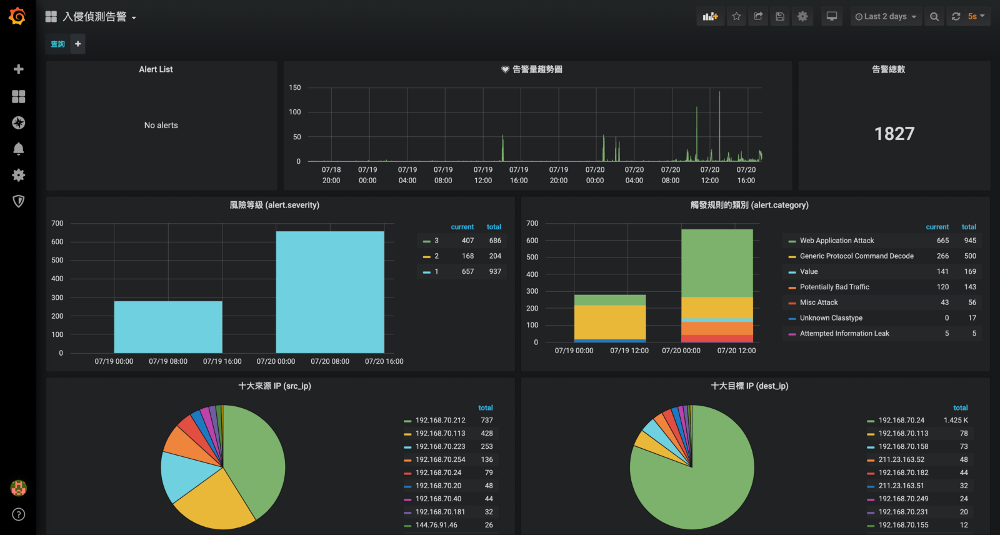
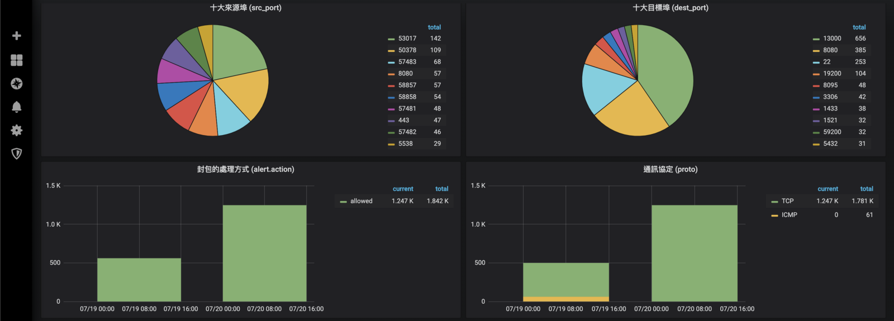

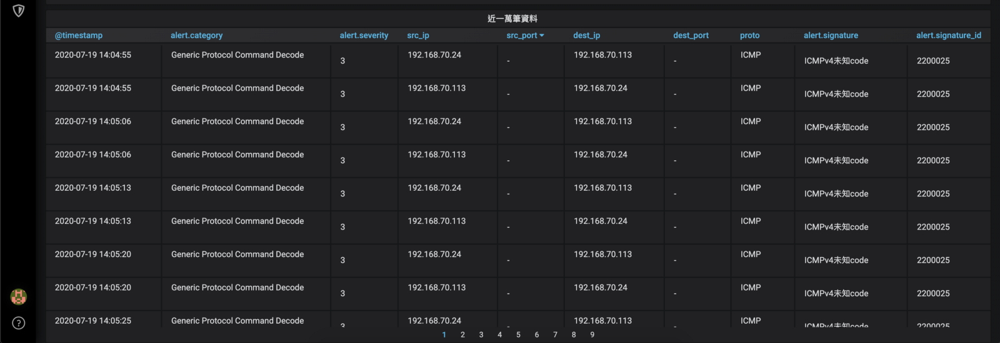

***

# 4. 設定告警 Setting Alert

## 4.1 設定「系統資源監控」儀表板的告警 Set the alert of the "System Resource Monitoring" dashboard

至「系統資源監控」儀表板，點選「CPU 使用率」圖的下拉選單，選擇「Edit」進行編輯。
Go to the "System Resource Monitoring" dashboard, click the drop-down menu of the "CPU Utilization" graph, and select "Edit" to edit.

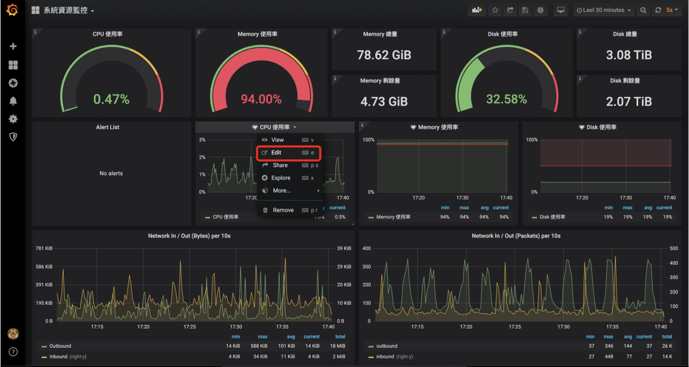

進入編輯畫面後，在左邊的選單選擇「Alert」至告警編輯頁籤，預設會有「當 CPU 使用率大於 10% 時會觸發告警」的設定。
After entering the editing screen, select "Alert" from the menu on the left to the alert editing tab. By default, there will be a setting of "當 CPU 使用率大於 10% 時會觸發告警 When the CPU usage is greater than 10%, an alert will be triggered".

點選右側的「Test Rule」按鈕可以測試此告警觸發條件現在的狀態。
Click the "Test Rule" button on the right to test the current state of the alert triggering condition.

返回「系統資源監控」儀表板並儲存儀表板，重新整理儀表板後可看到原先空白的「Alert List」區塊，出現三個有關 CPU 使用率、Disk 使用率、Memory 使用率的未知狀態：
Return to the "System Resource Monitoring" dashboard and save the dashboard. After refreshing the dashboard, you can see the original blank "Alert List", and there are three unknown statuses related to CPU usage, Disk usage, and Memory usage:

過了約一分鐘後，「Alert List」區塊顯示 CPU 使用率、Disk 使用率、Memory 使用率的健康狀態，其中綠色 OK 表示正常，紅色 ALERTING 表示異常。
After about a minute, the "Alert List" will display the health status of CPU usage, Disk usage, and Memory usage. The "OK" in green means normal, and the "ALERTING" in red means abnormal.

在「系統資源監控」儀表板中，有關 CPU 使用率、Disk 使用率、Memory 使用率異常的門檻值預設如下，使用者亦可自行編輯門檻值：
* CPU 使用率：當 CPU 使用率大於 10% 時會觸發告警
* Disk 使用率：當 Disk 使用率大於 50% 時會觸發告警
* Memory 使用率：當 Memory 使用率大於 90% 時會觸發告警
In the "System Resource Monitoring" dashboard, the default thresholds for abnormal CPU usage, Disk usage, and Memory usage are preset as follows, and users can edit the thresholds themselves:
* CPU usage: an alert will be triggered when the CPU usage is bigger than 10%
* Disk usage rate: when Disk usage rate is bigger than 50%, an alert will be triggered
* Memory usage rate: when Memory usage rate is bigger than 90%, an alert will be triggered 

## 4.2 設定「入侵偵測告警」儀表板的告警  Set the alert of the "Intrusion Detection Alert" dashboard

至「入侵偵測告警」儀表板，點選「告警量趨勢圖」的下拉選單，選擇「Edit」進行編輯。
Go to the "Intrusion Detection Alert" dashboard, click the drop-down menu of the "告警量趨勢圖 Alarm Volume Trend Graph", and select "Edit" to edit.

進入編輯畫面後，在左邊的選單選擇「Alert」至告警編輯頁籤，預設會有「當告警量大於 2000 時會觸發告警」的設定。
After entering the editing screen, select "Alert" from the menu on the left to the alert editing tab. By default, there will be a setting of "當告警量大於 2000 時會觸發告警 When the alert volume is bigger than 2000, an alert will be triggered".

返回「入侵偵測告警」儀表板並儲存儀表板，重新整理儀表板後可看到原先空白的「Alert List」區塊，出現有關「入侵偵測告警 告警觸發」的未知狀態：
Return to the "Intrusion Detection Alert" dashboard and save the dashboard. After refreshing the dashboard, you can see the original blank "Alert List", and an unknown state about "入侵偵測告警 告警觸發Intrusion Detection Alert Triggering" appears:

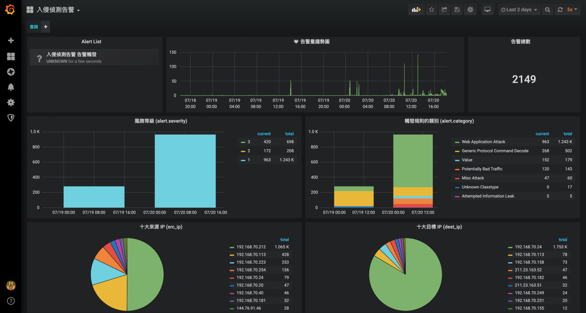

過了約一分鐘後，「Alert List」區塊顯示「入侵偵測告警 告警觸發」的健康狀態，其中綠色 OK 表示正常，紅色 ALERTING 表示異常。
After about one minute, the "Alert List" will display the health status of "入侵偵測告警 告警觸發 Intrusion Detection Alert Alert Triggered". The "OK" in green means normal and the "ALERTING" in red means abnormal.

在「入侵偵測告警」儀表板中，有關「入侵偵測告警 告警觸發」異常的門檻值預設如下，使用者亦可自行編輯門檻值：
* 入侵偵測告警 告警觸發：當告警量大於 2000 時會觸發告警
In the "Intrusion Detection Alert" dashboard, the default threshold for the exception of "Intrusion Detection Alert Trigger" is preset as follows, and users can also edit the threshold by themselves:
* 入侵偵測告警 告警觸發：當告警量大於 2000 時會觸發告警 Intrusion detection alarm Alarm trigger: when the alarm volume is bigger than 2000, an alert will be triggered

***

# 5. 設定告警通知 Set alert notification

## 5.1 設定收信人 Set Recipient

至左側選單「Alerting」>「Notification channels」，點選「Add channel」新增告警通知 email 的收信人。
Go to the left menu "Alerting"> "Notification channels", click "Add channel" to add the recipient of the alert notification email.

在 Name 欄位填入收信人的名稱，在 Addresses 欄位填入收信人的 email，按下「Save」按鈕儲存。
Fill in the name of the recipient in the Name field, fill in the recipient’s email in the Addresses field, and press the "Save" button to save.

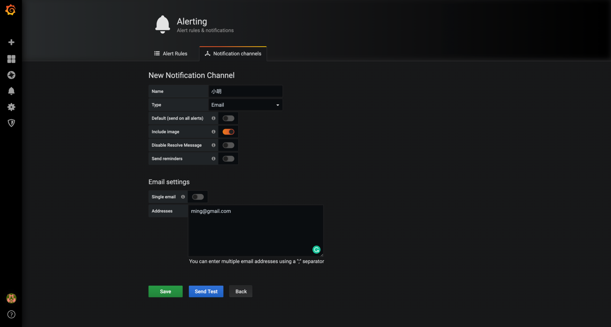

## 5.2 設定告警通知 Setting Alert Notification

到每個有設定告警的儀表板圖表，設定告警通知收信人。例如「系統資源監控」儀表板的「CPU 使用率」圖表，進入編輯頁面後，在 Alert 頁籤的 Notifications 區塊，Send to 的欄位選擇剛剛設定的收信人名稱，並儲存儀表板即可。
Go to each dashboard with alerts setting and set the alert to notify the recipient. For example, after entering the edit page in the "CPU Usage" of the "System Resource Monitoring" dashboard, select the recipient name which just set in the Notifications section of the Alert tab, and save the dashboard in the Send to field.

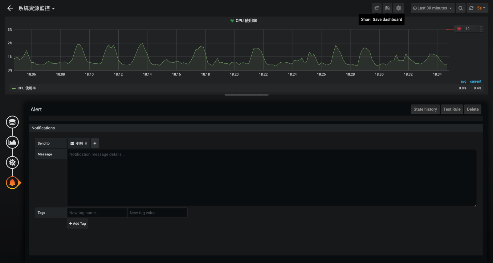

需要設定以下圖表的告警通知：
* 「系統資源監控」儀表板的「CPU 使用率」
* 「系統資源監控」儀表板的「Disk 使用率」
* 「系統資源監控」儀表板的「Memory 使用率」
* 「入侵偵測告警」儀表板的「告警量趨勢圖」
The following dashboards/ charts need to set up the alert notification:
* "CPU Usage" on the "System Resource Monitoring" dashboard
* "Disk Usage" on the "System Resource Monitoring" dashboard
* "Memory Usage" on the "System Resource Monitoring" dashboard
* "Alert volume trend graph" on the "Intrusion Detection Alert" dashboard

***

恭喜您！您已完成「Grafana 告警通知設定」。
Congratulations! You have completed "Grafana Alert Notification Settings".
