# Grafana 告警通知設定

在日誌收容的架構中，本系統提供 Grafana 儀表板供維運人員進行查閱，利用視覺化的呈現，減少人員的操作進入門檻。

以下提供儀表板之操作步驟：
1. 登入 Grafana
2. 串接資料來源
*  2.1 資料來源一：metricbeat
*  2.2 資料來源二：suricata
3. 匯入儀表板
*  3.1 匯入「系統資源監控」儀表板
*  3.2 匯入「入侵偵測告警」儀表板
4. 設定告警
*  4.1 設定「系統資源監控」儀表板的告警
*  4.2 設定「入侵偵測告警」儀表板的告警
5. 設定告警通知
*  5.1 設定收信人
*  5.2 設定告警通知

***

# 1. 登入 Grafana

儀表板之登入預設網址為「http://your_ip:13000」，預設帳號為 admin，預設密碼為 admin。填入後按「Log In」按鈕。

若使用預設admin帳號登入，並且沒有更改預設admin密碼的話，在按下「Log In」按鈕後，會出現「Change Password」的修改預設密碼提醒畫面。若要修改密碼，可於此畫面輸入新密碼，並按下「Save」按鈕儲存新密碼。若不需修改密碼，則可直接按「Skip」按鈕即可跳過此步驟，以後再到系統中修改密碼即可。

登入後會到空白的 Home 頁面。依 Grafana 版本不同，Home 頁面會略有不同，以下畫面為 Grafana v.6.2.5 的 Home 頁面。右下角的區塊是已安裝的 plugins，清單會略有不同。

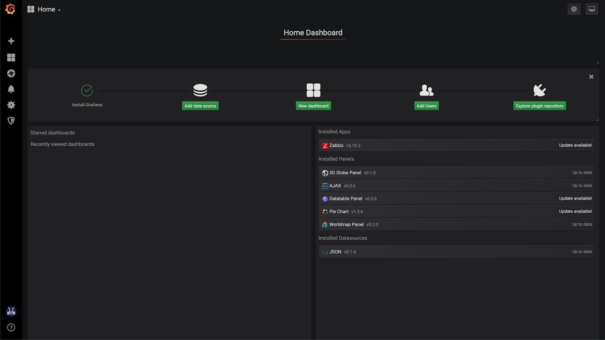

***

# 2. 串接資料來源

至左邊選單的「Configuration」>「Data Sources」頁面，按下「Add data source」按鈕，新增資料來源。

在資料來源類型清單中，選擇「Elasticsearch」。

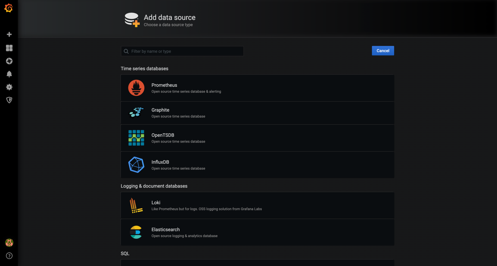

## 2.1 資料來源一：metricbeat

新增一個名為「metricbeat-*」的資料來源，並填入以下資訊：
* 在 Name 欄位填入「metricbeat-*」
* 在 URL 欄位填入「http://your_ip:19200」
* 在 Elasticsearch details 區塊，Index name 欄位填入「metricbeat-*」
* Time field name 填入「@timestamp」
* Version 選擇「7.0+」

填完後按下綠色「Save & Test」按鈕，若出現「Index OK. Time field name OK.」訊息則表示成功。

## 2.2 資料來源二：suricata

再新增一個名為「suricata-*」的資料來源，並填入以下資訊：
* 在 Name 欄位填入「suricata-*」
* 在 URL 欄位填入「http://your_ip:19200」
* 在 Elasticsearch details 區塊，Index name 欄位填入「suricata-*」
* Time field name 填入「log_time」
* Version 選擇「7.0+」

填完後按下綠色「Save & Test」按鈕，若出現「Index OK. Time field name OK.」訊息則表示成功。

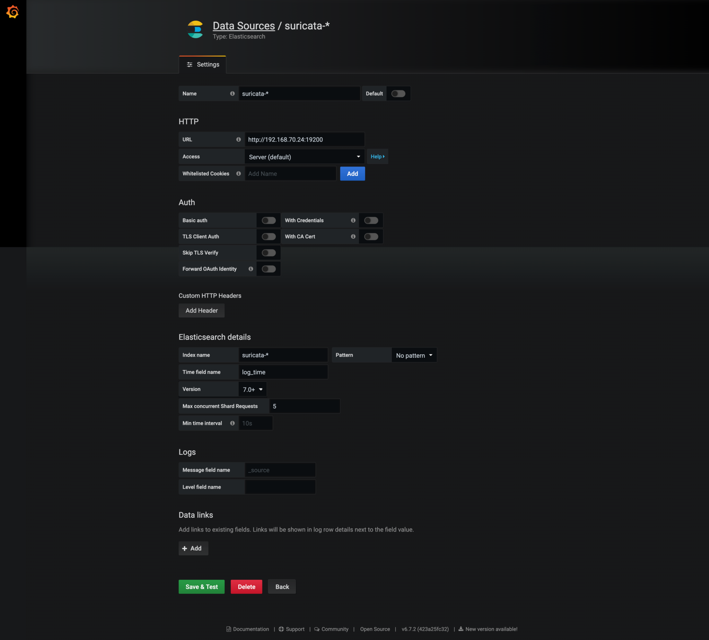

***

# 3. 匯入儀表板

至左邊選單的「Create」>「Import」頁面，匯入從 GitHub SecBuzzerESM 專案下載的儀表板，儀表板檔案會放在「SecBuzzerESM」>「grafana_dashboards」中。

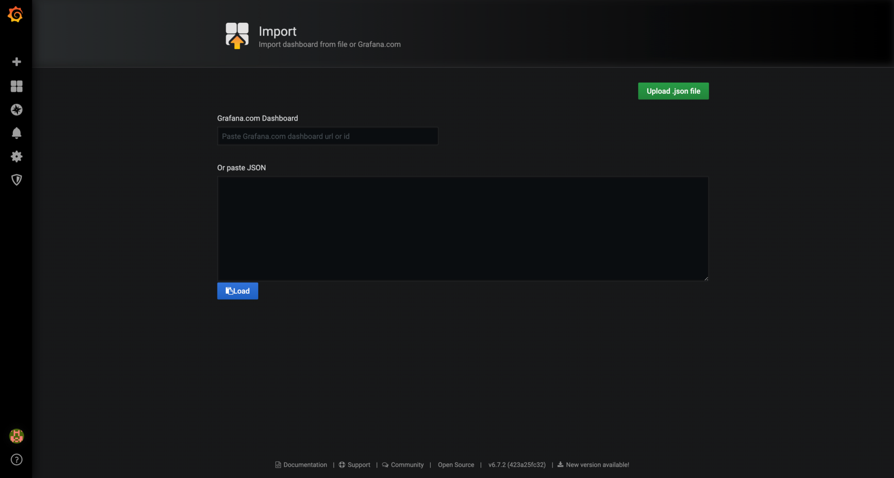

## 3.1 匯入「系統資源監控」儀表板

在「Import」頁面按下右上角的綠色按鈕「Upload .json file」，選擇「系統資源監控.json」檔案（此檔案會位於「SecBuzzerESM」>「grafana_dashboards」中），按下「Import」按鈕。

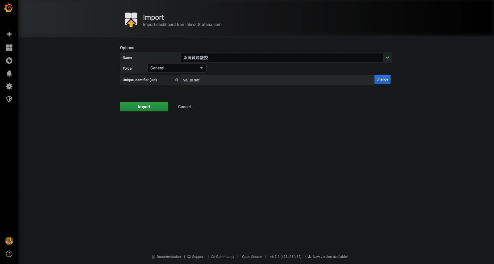

匯入成功即可看到「系統資源監控」儀表板畫面。此儀表板的資料來源是與「metricbeat-*」串接，若沒有順利看到儀表板圖表，請注意資料來源「metricbeat-*」的設定是否與上一個章節「2. 串接資料來源」中的設定一致。

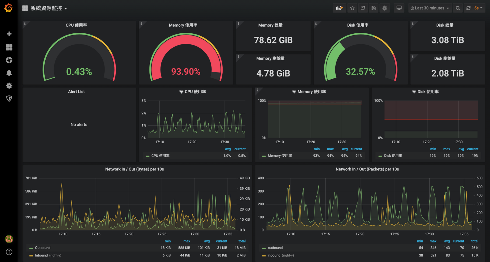

## 3.2 匯入「入侵偵測告警」儀表板

在「Import」頁面按下右上角的綠色按鈕「Upload .json file」，選擇「入侵偵測告警.json」檔案（此檔案會位於「SecBuzzerESM」>「grafana_dashboards」中），按下「Import」按鈕。

匯入成功即可看到「入侵偵測告警」儀表板畫面。此儀表板的資料來源是與「suricata-*」串接，若沒有順利看到儀表板圖表，請注意資料來源「suricata-*」的設定是否與上一個章節「2. 串接資料來源」中的設定一致。

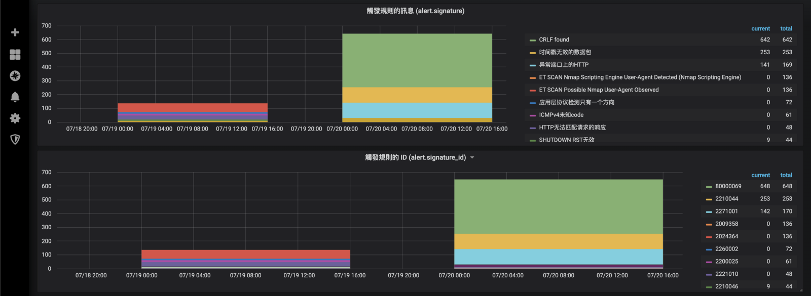

***

# 4. 設定告警

## 4.1 設定「系統資源監控」儀表板的告警

至「系統資源監控」儀表板，點選「CPU 使用率」圖的下拉選單，選擇「Edit」進行編輯。

進入編輯畫面後，在左邊的選單選擇「Alert」至告警編輯頁籤，預設會有「當 CPU 使用率大於 10% 時會觸發告警」的設定。

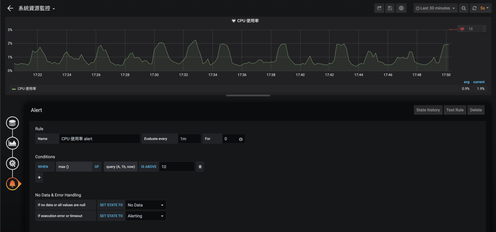

點選右側的「Test Rule」按鈕可以測試此告警觸發條件現在的狀態。

返回「系統資源監控」儀表板並儲存儀表板，重新整理儀表板後可看到原先空白的「Alert List」區塊，出現三個有關 CPU 使用率、Disk 使用率、Memory 使用率的未知狀態：

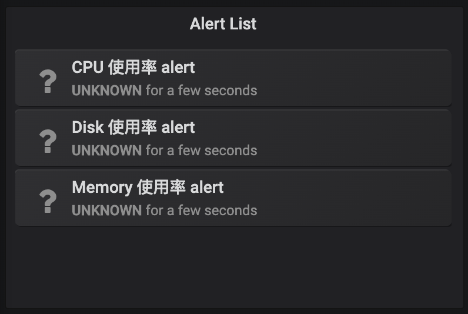

過了約一分鐘後，「Alert List」區塊顯示 CPU 使用率、Disk 使用率、Memory 使用率的健康狀態，其中綠色 OK 表示正常，紅色 ALERTING 表示異常。

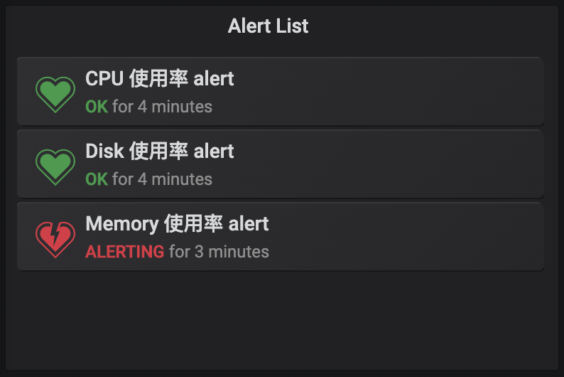

在「系統資源監控」儀表板中，有關 CPU 使用率、Disk 使用率、Memory 使用率異常的門檻值預設如下，使用者亦可自行編輯門檻值：
* CPU 使用率：當 CPU 使用率大於 10% 時會觸發告警
* Disk 使用率：當 Disk 使用率大於 50% 時會觸發告警
* Memory 使用率：當 Memory 使用率大於 90% 時會觸發告警

## 4.2 設定「入侵偵測告警」儀表板的告警

至「入侵偵測告警」儀表板，點選「告警量趨勢圖」的下拉選單，選擇「Edit」進行編輯。

進入編輯畫面後，在左邊的選單選擇「Alert」至告警編輯頁籤，預設會有「當告警量大於 2000 時會觸發告警」的設定。

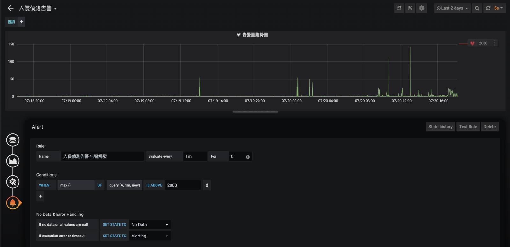

返回「入侵偵測告警」儀表板並儲存儀表板，重新整理儀表板後可看到原先空白的「Alert List」區塊，出現有關「入侵偵測告警 告警觸發」的未知狀態：

過了約一分鐘後，「Alert List」區塊顯示「入侵偵測告警 告警觸發」的健康狀態，其中綠色 OK 表示正常，紅色 ALERTING 表示異常。

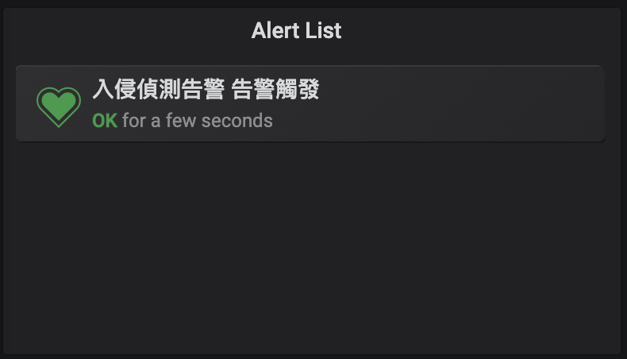

在「入侵偵測告警」儀表板中，有關「入侵偵測告警 告警觸發」異常的門檻值預設如下，使用者亦可自行編輯門檻值：
* 入侵偵測告警 告警觸發：當告警量大於 2000 時會觸發告警

***

# 5. 設定告警通知

## 5.1 設定收信人

至左側選單「Alerting」>「Notification channels」，點選「Add channel」新增告警通知 email 的收信人。

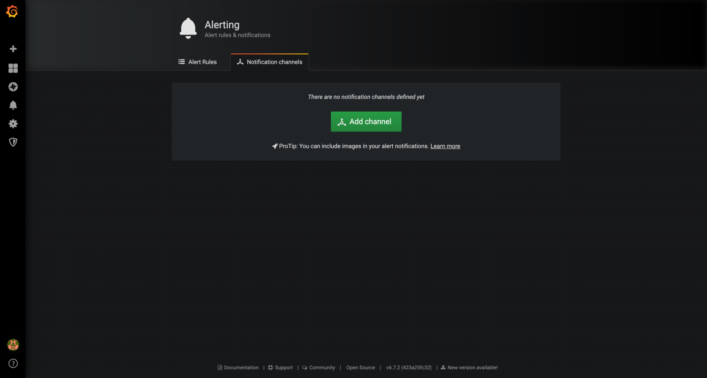

在 Name 欄位填入收信人的名稱，在 Addresses 欄位填入收信人的 email，按下「Save」按鈕儲存。

## 5.2 設定告警通知

到每個有設定告警的儀表板圖表，設定告警通知收信人。例如「系統資源監控」儀表板的「CPU 使用率」圖表，進入編輯頁面後，在 Alert 頁籤的 Notifications 區塊，Send to 的欄位選擇剛剛設定的收信人名稱，並儲存儀表板即可。

需要設定以下圖表的告警通知：
* 「系統資源監控」儀表板的「CPU 使用率」
* 「系統資源監控」儀表板的「Disk 使用率」
* 「系統資源監控」儀表板的「Memory 使用率」
* 「入侵偵測告警」儀表板的「告警量趨勢圖」

***

恭喜您！您已完成「Grafana 告警通知設定」。