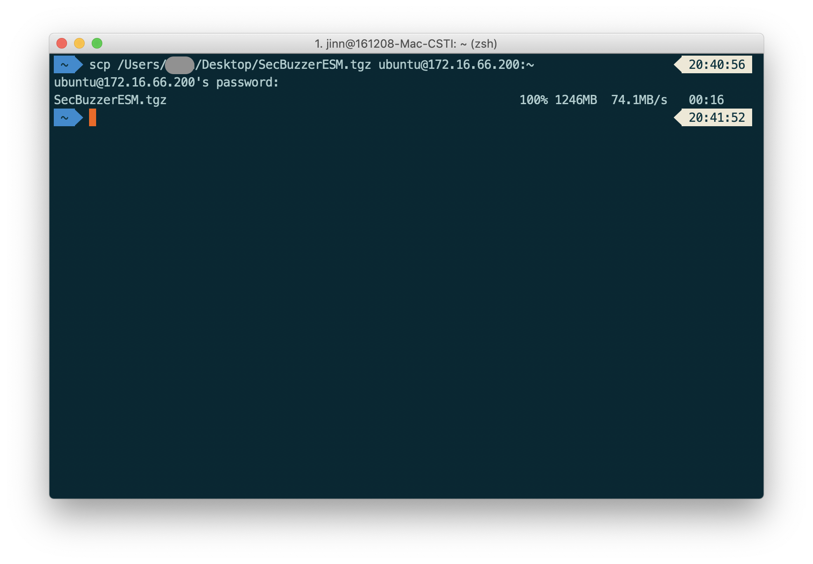
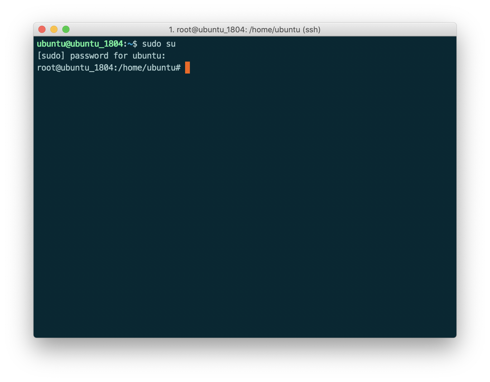
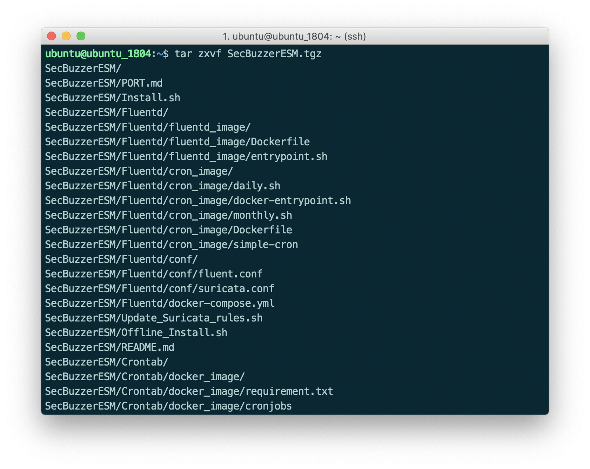
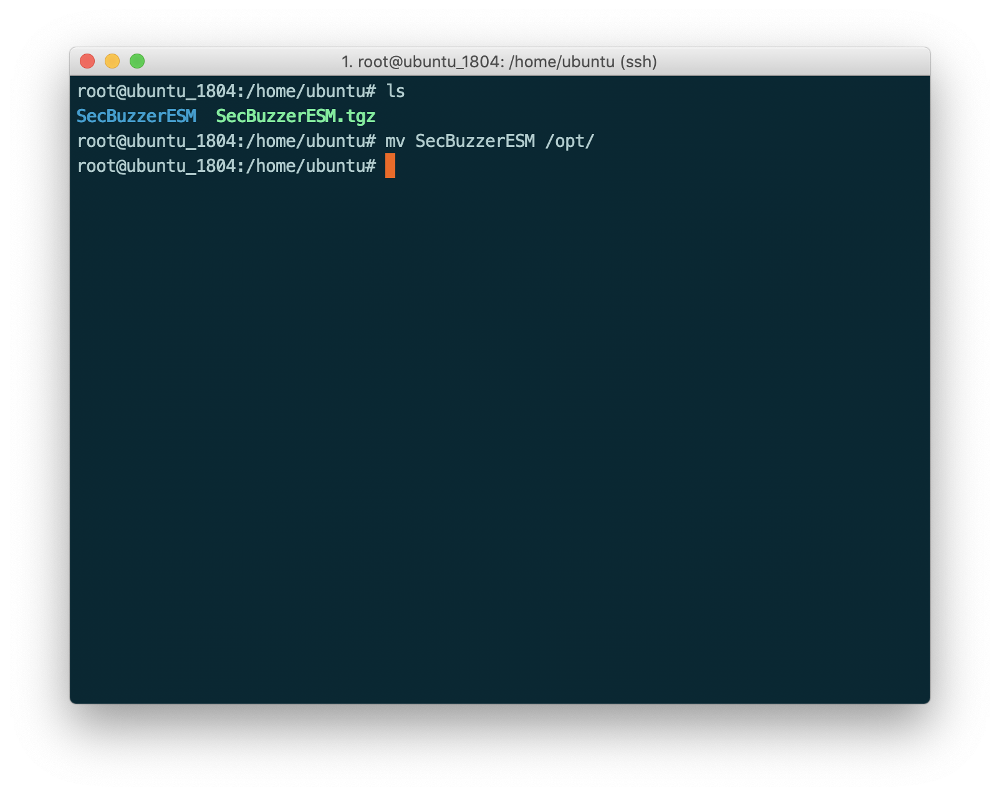
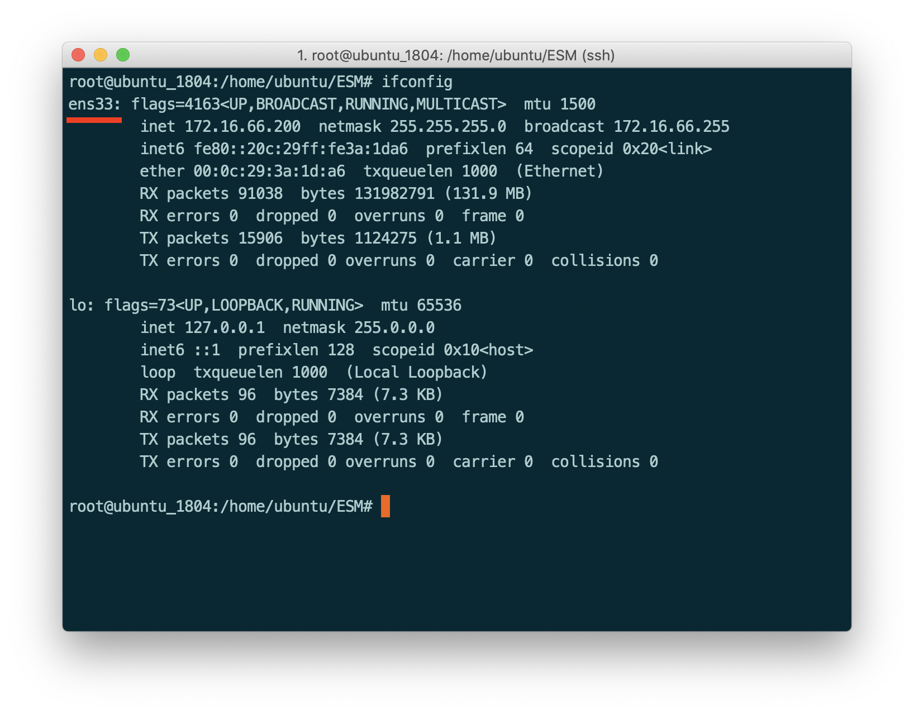
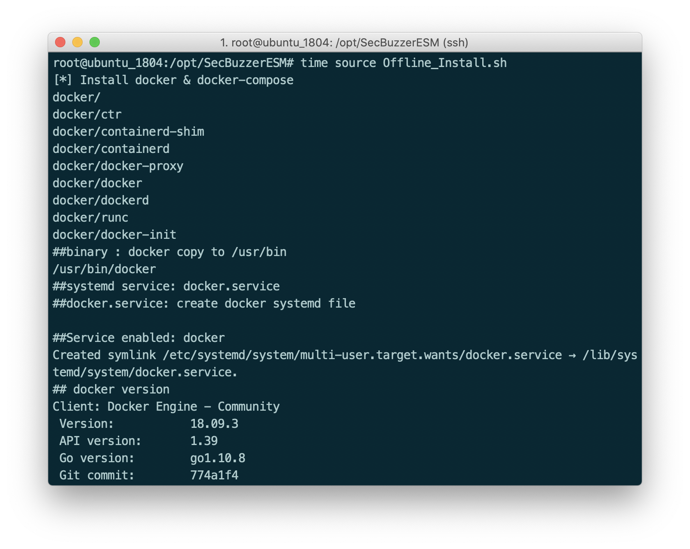
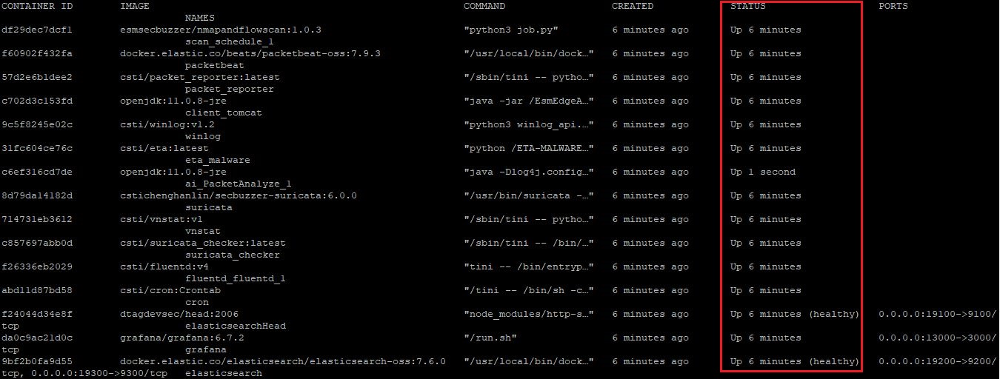
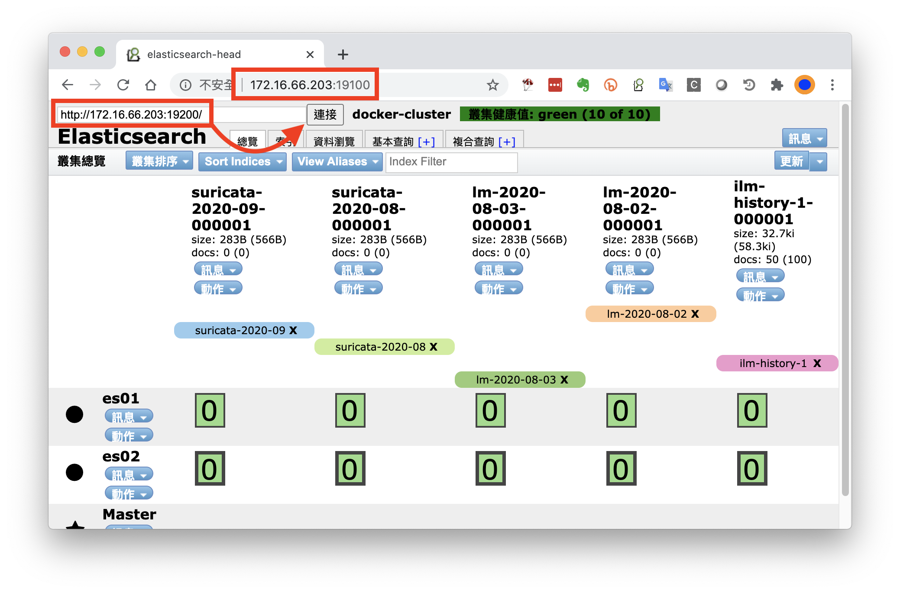
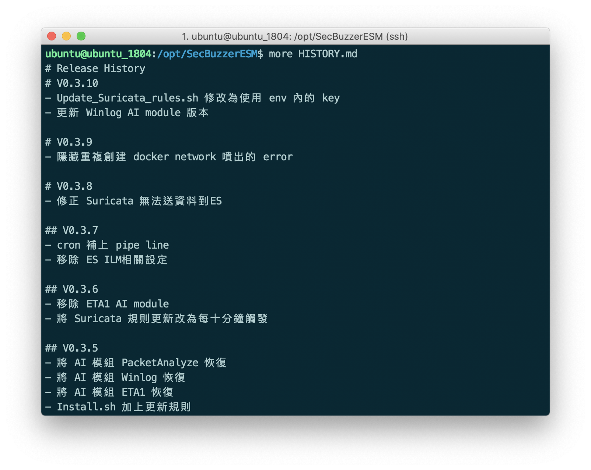

# SecBuzzerESM 離線安裝手冊

# 1. 硬體需求

硬體配備需求依不同目的而有所差異，若只想測試基本功能，可以使用個人版進行安裝驗證，若在較大的場域中測試，則硬體依場域需求或流量大小而有所變更，其最基本的配備建議如下：

個人測試：

- OS：Ubuntu 18.04.4 UP Server 英文版
- CPU：2.0 GHz 64-bit processor, dual core (or two virtual CPUs)
- MEM：10G UP
- HDD：20G ~ 30G UP

場域測試：

- OS：Ubuntu 18.04.4 UP Server 英文版
- CPU：2.2 GHz 64-bit processor, 8 core
- MEM：32G UP
- HDD：2T ~ 4T

確認項目：

- 確認OS是否有支援SSH，未支援者可執行以下指令進行安裝

```bash
sudo apt-get install openssh-server
```

- 確認時間/時區是否正確 (請設置台灣時區)
- 請確認OS系統屬於 **乾淨** 的狀態，並沒有安裝其他工具，例如：Docker、Elasticsearch、Fluentd、Grafana等，ESM的安裝程式皆會自動安裝這些工具

# 2. 系統安裝說明 (Offline)

離線安裝版步驟請參考下列說明：(即安裝階段不需網路連線)

## 2.1 事前準備

請先下載離線安裝包，並使用自己習慣的傳輸工具將檔案傳輸至Ubuntu OS中，例如：Linux SCP指令、FTP軟體

- 離線安裝包下載：[SecBuzzerESM_V0.5.5](https://myspace.iii.org.tw/d/f/576620239295394189)

在此以scp指令為例：(以下為示意圖，若檔案有版本號的話指令請自行調整)



進入Ubuntu中，因安裝過程需使用 `root` 權限，請先進行帳號的切換

```bash
sudo su
```



## 2.2 解壓縮離線安裝包

將離線安裝包進行解壓縮，指令如下：

```bash
tar zxvf SecBuzzerESM_XXX.tgz (XXX代表版本號)
```




## 2.3 移動到 opt 目錄下

將整個解壓縮出來之SecBuzzerESM目錄，移至 `opt` 目錄下


```bash
mv SecBuzzerESM /opt/
```



## 2.4 查閱網卡名稱

請執行以下指令查看網卡名稱，並記住該網卡名稱(Interface)，後續需於組態檔中設置


```bash
ifconfig
```



## 2.5 設定 SecBuzzerESM.env

這小節將會進行系統相關設定的說明，分別說明如下：首先，請進入 `SecBuzzerESM.env` 組態檔進行設置，此處是以 `nano` 編輯器為例，可自行使用習慣的編輯器進行編輯


```bash
cd /opt/SecBuzzerESM
nano SecBuzzerESM.env
```

`SecBuzzerESM.env` 包含的設定參數如下所示，將一一說明其設定方法與代表意義

```bash
# === Elasticsearch === 
ES_VOLUME_PATH=/opt/Logs/ES/volume
ES_MEM=1024m
# === Fluentd ===
FLUENTD_LOG_PATH=/opt/Logs/Fluentd/Logs
FLUENTD_BUFFER_PATH=/opt/Logs/Buffers
# === Suricata ===
SURICATA_LOG_PATH=/opt/Logs/Suricata
IF_NAME=
# === Grafana ===
GF_SMTP=false
GF_SMTP_HOST=smtp.gmail.com:465
GF_SMTP_FROM_ADDRESS=
GF_SMTP_USER=
GF_SMTP_PASSWORD=
# === WEB ===
WEB_IF_NAME=
API_KEY_VALUE=
ORG_3_CODE=
```

編輯完成後輸入 `Ctrl+X` 存檔 (以`nano`編輯器為例)

### 2.5.1 Elasticsearch

- ES_VOLUME_PATH

Elasticsearch Volume 存放位置，即資料保存處，`建議保持預設`

- ES_MEM

設定 Elasticsearch 記憶體上限，預設值為 1024m (個人版適用)，基本的配置原則為總記憶體的一半，但不超過32G，例如：系統總記憶體若為32G，則記憶體可設置16g，若總記憶體為64G，則可設置31g (不超過32G)

註：記憶體單位建議用小寫，例如：`m`、`g`

---

### 2.5.2 Fluentd


- FLUENTD_LOG_PATH

Fluentd 收容資料時所存放的位置，`建議保持預設值`

- FLUENTD_BUFFER_PATH

Fluentd Buffer 存放位置，`建議保持預設值`

---

### 2.5.3 Suricata

- SURICATA_LOG_PATH

Suricata 當偵測到告警時，會將告警資料輸出至 eve.json 存放，此參數為設置 eve.json 的存放路徑，`建議保持預設值`

- IF_NAME

Suricata 監控的網卡，即透過該網卡來監控網路流量，進而偵測異常行為，因每位使用者的環境不同，所以網卡Interface會相異，`此欄位必需修改`

>註：取得網卡Interface的方法請參閱 2.4 節之說明

---

### 2.5.4 Grafana

ESM已內建Grafana視覺化儀表板，以下設定參數為用來設置通知告警的信箱資訊。
>註：目前尚未開通此功能，設置可先略過

- GF_SMTP

SMTP 功能是否開啟, 開啟填 `true`

- GF_SMTP_HOST

SMTP Server 設定, 預設為 Google

- GF_SMTP_FROM_ADDRESS

發出 E-mail 時使用的地址

- GF_SMTP_USER

SMTP 帳號

- GF_SMTP_PASSWORD

SMTP 密碼

---

### 2.5.5 WEB

- WEB_IF_NAME

在規則觸發後，ESM會將告警資訊拋轉至雲端，因此需設置一網卡來進行傳送，此網卡在個人主機測試時，可能會與 `Suricata`的參數`IF_NAME `相同，但在實際場域上運行時，通常會設置二張不同的網卡，`IF_NAME `負責網路流量的導入(Port Mirror)，另一張`WEB_IF_NAME `負責本機對外的資料傳送，`此欄位必填`

- API_KEY_VALUE

從ESM網站上取得的 API KEY，請參考以下說明，`此欄位必填`

- ORG_3_CODE

從 ESM 網站上取得單位代碼，請參考以下說明，`此欄位必填`

欲取得API KEY以及單位代碼，需先登入ESM網站，並由網頁右上角功能選單的`取得API Key`進入，即可取得相關資訊


## 2.6 安裝 SecBuzzerESM

經組態檔設定後，即可正式進行安裝作業，請執行以下指令：

```bash
cd /opt/SecBuzzerESM
source Offline_Install.sh
```
>註：可在指令前加一個 time 指令，自動計算安裝時間：`time source Offline_Install.sh`



## 2.7 執行 SecBuzzerESM

安裝完成後，請進行系統的啟動


```bash
cd /opt/SecBuzzerESM
./compose.sh up # 啟動 ESM
```

若在執行ESM的過程中，有遇到臨時不可解之問題，可以搭配「關閉ESM」或「重啟ESM」指令來進行修復


```bash
./compose.sh down # 關閉 ESM (可搭配啟動指令重啟)
./compose.sh down && ./compose.sh up # 重啟 ESM
```


### 2.7.1 驗証 ESM 是否正常


```bash
docker ps -a
```

若啟動不正常則`STATUS`欄位會顯示`restart`或是`exit`，正常情況會顯示該Container已經啟動多久時間



### 2.7.2 驗証 Elasticsearch 是否正常運作

可以透過連線至Elasticsearch(ES)的方式，來確認ES是否正常運作

- 連線至ES Head(查看ES狀態的工具)：http://your_ip/19100
- 再由ES Head連線至ES查看：http://your_ip/19200

如下圖所示：




## 2.8 Troubleshooting

### 2.8.1 查看系統版本

ESM的版本記錄存放於`HISTORY.md`中，可以用`cat`或`more`指令來查看

```bash
cd /opt/SecBuzzerESM
cat HISTORY.md # 或 more HISTORY.md
```


